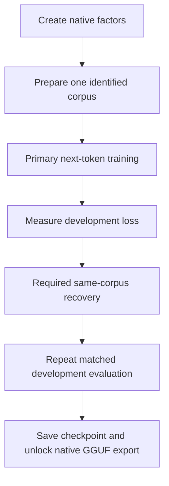

# Nexus Random Initialization Foundry

**RIF · Repaired lightweight edition · Technical and research documentation · 9 October 2026**

Nexus Random Initialization Foundry (RIF) is a local, browser-based environment for constructing small causal language models, training their parameters with WebGPU, inspecting development loss, saving resumable checkpoints, and exporting model weights. It provides two experimental routes: a dense transformer and a transformer whose weight matrices are represented by trainable binary latent factors and scaling vectors.

“Random initialization” describes how new model parameters are created. It does not mean that every weight starts at zero. The application contains no pretrained language model, and successful training or export does not establish useful language ability. RIF is intended for inspectable experiments in initialization, optimization, low-bit representation, corpus handling, and serialization.

This README uses the new product name while documenting the existing, hash-identified lightweight release. Its filenames remain `Nexus_Model_Foundry_Repaired.html` and `Nexus_Foundry_Repaired_Source_and_Tests.zip`. The documented implementation is the [Foundry source](./src/foundry.js); the accompanying `RELEASE_MANIFEST.json` identifies the tested files and saved results. This documentation does not rename or modify those binaries.

## Contents

- [Quick start](#quick-start)
- [Capabilities and implementation scope](#capabilities-and-implementation-scope)
- [Architecture and tokenizer](#architecture-and-tokenizer)
- [Initialization and optimization](#initialization-and-optimization)
- [Native binary factor models](#native-binary-factor-models)
- [Required native recovery](#required-native-recovery)
- [Corpus preparation and evaluation](#corpus-preparation-and-evaluation)
- [Checkpoints and GGUF](#checkpoints-and-gguf)
- [Memory and runtime limits](#memory-and-runtime-limits)
- [Validation evidence](#validation-evidence)
- [Source layout and reproducibility](#source-layout-and-reproducibility)
- [Scientific limitations and research directions](#scientific-limitations-and-research-directions)
- [Provenance and licensing](#provenance-and-licensing)
- [References](#references)

## Quick start

1. Open the supplied `Nexus_Model_Foundry_Repaired.html` in a browser with working WebGPU support. The application requests a high-performance adapter, but availability depends on the browser, operating system, driver, and device.
2. If WebGPU is unavailable from a local file, serve the containing directory locally:

   ```sh
   python3 -m http.server 8765 --bind 127.0.0.1
   ```

   Open `http://localhost:8765/Nexus_Model_Foundry_Repaired.html`.
3. Run the isolated native self-test before creating a model or beginning a long experiment. Save any existing model and reload the page first. The self-test is a small numerical check, not a qualification of the device for sustained training.
4. Begin with the approximately 0.4-million dense-equivalent-weight smoke-test preset. Select a dense export target or a native factor target. A 0.25-bit native plan may reject small dimensions because its minimum rank and scale vectors do not fit the requested budget.
5. Create the model, then import a local corpus. The included [smoke-test corpus](./examples/smoke_test_corpus.jsonl) is suitable for checking the workflow. For the larger dataset, reconstruct and extract its download before selecting the complete JSONL file.
6. Set a small initial target-token budget. The default 10,000-target run is a smoke test. **Use one complete training pass** sets the primary budget to the available training prediction targets; native recovery retains a separate budget.
7. Train, evaluate development data, and save a full checkpoint. Native export remains locked until primary training, required same-corpus recovery, and its before/after development evaluation complete.
8. Export GGUF, reload the export, prepare the same corpus again, and compare its behavior. Keep the full checkpoint for optimizer-state continuation.

Model computation runs through the browser's WebGPU adapter. Local corpus import does not require a hosted training service. Optional hosted dataset retrieval does make network requests and depends on the provider's availability and access terms.

## Capabilities and implementation scope

| Area | Implemented behavior | Important boundary |
|---|---|---|
| Dense training | Full-model FP32 parameter optimization with AdamW-style updates | F32, F16, Q8_0, and Q4_0 are export encodings, not four training arithmetic modes |
| Native factor training | Directly initialized sign factors, scales, and normalization parameters | FP32 latent masters and optimizer state remain resident during training |
| Native storage targets | 1, 0.5, and 0.25 target bits per dense-equivalent matrix weight | Rank floors, normalization tensors, and container overhead affect feasibility and total size |
| Corpus import | Streaming JSONL and blank-paragraph TXT; bounded JSON arrays | Host RAM, configured ceilings, and browser limits still apply |
| Evaluation | Development next-token negative log-likelihood and perplexity | The normal evaluation button excludes reserved test/probe documents |
| Persistence | Dense `.nxtrain` and native `.nxnative` checkpoints; GGUF export/import | GGUF reload creates fresh optimizer state |
| Generation | Local autoregressive greedy argmax | Last 256 tokens are recomputed; there is no KV cache or stochastic sampler |
| Compatibility | Tested dense GGUF fixtures in official llama.cpp CPU libraries | Native `nexus_foundry_factor` GGUF requires the Foundry factor runtime |

The lightweight release omits the approximately 30 MB of embedded legacy Adapter Studio, Glass Chat, and Recovery Studio payloads. Those remain separate tools with their own architecture and tokenizer restrictions. Features of a newer Recovery Studio release should not be inferred from this README.

## Architecture and tokenizer

### Causal transformer

The implementation uses a bias-free, Llama-style decoder architecture: token embeddings, pre-normalized causal attention, residual connections, gated feed-forward blocks, final normalization, and an output projection. New models expose width, layer count, attention heads, and feed-forward width. The creation path sets the number of key/value heads equal to query heads; compatible imported configurations can use grouped-query attention.

At each attention layer, projected queries and keys receive rotary position transformations. The attention computation is:

$$
\operatorname{Attention}(Q,K,V)
=\operatorname{softmax}\left(\frac{QK^\top}{\sqrt{d_h}}+M\right)V,
$$

where the causal mask excludes future positions. The code materializes attention scores and probabilities. It does not implement FlashAttention. The transformer lineage follows [Vaswani et al. (2017)](https://arxiv.org/abs/1706.03762); rotary position encoding follows the research direction described by [Su et al. (2021)](https://arxiv.org/abs/2104.09864).

Normalization uses a learned scale vector:

$$
\operatorname{RMSNorm}(x)
=\gamma\odot\frac{x}{\sqrt{\frac{1}{d}\sum_{j=1}^{d}x_j^2+\epsilon}}.
$$

The feed-forward activation is a SwiGLU-style product, `SiLU(gate) × up`, followed by a down projection. These components relate to [Zhang and Sennrich (2019)](https://arxiv.org/abs/1910.07467) and [Shazeer (2020)](https://arxiv.org/abs/2002.05202). Their inclusion does not imply reproduction of those papers' complete experimental systems.

For newly created models, the RoPE base is 10,000 and normalization epsilon is `1e-5`. Forward sequences are limited to 512 tokens. The generator independently limits each recomputed prefix to its most recent 256 tokens, even when training used longer sequences. It can request up to 512 newly generated tokens, stopping earlier on an end token or cancellation.

### Byte vocabulary

New models use a 258-entry UTF-8 byte vocabulary:

- IDs 0–255 represent byte values.
- BOS is 256; EOS is 257.
- Corpus documents are framed with BOS and EOS.
- Unicode characters can occupy multiple tokens because the representation is byte-based.

Dense byte-model GGUF files carry `nexus.tokenizer=utf8-byte-v1`, a GPT-2-compatible byte-to-token representation, empty BPE merges, and explicit special-token insertion flags. That metadata representation does not make the model a GPT-2 pretrained model or give it a learned subword vocabulary.

The dense importer also recognizes the supported SmolLM/SmolLM2 BPE contract, subject to architecture and metadata checks. Native factors require the 258-token byte vocabulary. Word totals, byte-token totals, and SmolLM tokenizer counts are different quantities; perplexities from different tokenizations are not directly comparable.

## Initialization and optimization

### Dense initialization

`randomWeights` uses the selected seed with a deterministic linear-congruential generator. Normalization scales start at one. Matrix entries are sampled uniformly:

$$
W_{jk}\sim\mathcal U(-\sqrt{3}s,\sqrt{3}s),\qquad
s=\begin{cases}0.02&\text{token embeddings}\\1/\sqrt{i}&\text{other matrices}\end{cases}
$$

where $i$ is the input dimension. Thus initialization is random and scale-dependent, with specific deterministic values for normalization parameters. Zero-initialized gradient buffers and optimizer moments should not be confused with an all-zero model. The seed is useful for reproducing initialization; it is not a guarantee of identical floating-point results across devices or drivers.

### Objective and update

Primary training minimizes next-token cross-entropy:

$$
\mathcal L_{\mathrm{CE}}
=-\frac{1}{N}\sum_{t=1}^{N}\log p_\theta(x_{t+1}\mid x_{\leq t}).
$$

Training walks the retained documents in order, forms shifted input/target windows within each document, and resets at document boundaries. It does not concatenate unrelated documents into a shared attention context. Exact partial target budgets are supported. Repeated passes revisit existing examples rather than creating new information.

Gradients accumulate across the selected number of windows, are normalized by the actual accumulated target count, and receive global-norm clipping at one. The implementation uses first- and second-moment coefficients 0.9 and 0.999, bias correction, epsilon `1e-8`, and decoupled weight decay:

$$
m_t=0.9m_{t-1}+0.1g_t,\qquad
v_t=0.999v_{t-1}+0.001g_t^2,
$$

$$
\theta_t=\theta_{t-1}-\eta_t
\left(\frac{\widehat m_t}{\sqrt{\widehat v_t}+10^{-8}}
+\lambda\theta_{t-1}\right).
$$

Here $g_t$ denotes the normalized, clipped gradient. This update is grounded in [Adam](https://arxiv.org/abs/1412.6980) and [decoupled weight decay](https://arxiv.org/abs/1711.05101). The controller combines a short warmup with cosine decay toward 10% of the selected learning rate. Parameters, gradients, moments, and shader arithmetic use FP32 in this release.

A numerical failure marks the training state invalid and prevents normal continuation; restore a valid checkpoint. Pause occurs after a completed optimizer update. An interrupted experiment should retain its checkpoint, corpus identity, session cursor, and exact configuration.

## Native binary factor models

### Representation

For a matrix with $o$ output channels and $i$ input channels, RIF represents an effective weight as:

$$
W_{\mathrm{eff}}=
\operatorname{diag}(h)\,\operatorname{sign}(U)
\operatorname{diag}(\ell)\,\operatorname{sign}(V)
\operatorname{diag}(g),
$$

with $U\in\mathbb R^{o\times r}$, $V\in\mathbb R^{r\times i}$, and learned output, latent, and input scales $h,\ell,g$. The sign function returns +1 at zero and above, and −1 below zero. Scale values are rounded through FP16 for the forward pass. Normalization vectors remain separate FP32 parameters.

All model matrices, including token embeddings and the output projection, use this representation. Linear operations apply the factors successively. Embedding lookup uses selected factor rows. The native route initializes factors directly; it does not start with a pretrained dense matrix and then factorize that matrix.

Binary latent masters begin in approximately `[-0.5, 0.5)`. Input/output scales and normalization vectors begin at one; latent scales begin at $1/\sqrt{ri}$. During optimization, binary masters are constrained to `[-1, 1]`, and non-normalization scales are bounded to a finite range.

### Storage budget and rank floor

For a factorized matrix, packed storage contains $r(o+i)$ sign bits and $16(o+i+r)$ scale bits. Given target $b$ bits per dense-equivalent matrix weight, the implementation chooses:

$$
r=\min\left(
8\left\lfloor\frac{b\,i\,o-16(i+o)}{8(i+o+16)}\right\rfloor,
8\left\lfloor\frac{\min(i,o)}{8}\right\rfloor
\right).
$$

Ranks are multiples of eight and must be at least eight. Input columns must be byte-aligned. A requested target that cannot satisfy these conditions is rejected instead of silently changing the architecture or omitting scales.

The supported user-facing targets are 1, 0.5, and 0.25 bits per dense-equivalent matrix weight. These are **storage-planning targets**. FP32 normalization tensors, metadata, alignment, and container overhead contribute additional bytes. Reports distinguish matrix targets, packed tensor payload bits per equivalent weight, and whole-file bits per equivalent weight.

Training memory is much larger than the packed export. Each trainable scalar has an FP32 master, gradient, and two Adam moments: approximately 16 bytes before activations and temporary buffers. The implementation does not perform packed-bit optimizer updates or promise sub-bit VRAM use.

### Surrogate gradient

Hard sign is discontinuous. The declared clipped straight-through estimator substitutes:

$$
\frac{\partial\mathcal L}{\partial u}
\approx
\frac{\partial\mathcal L}{\partial\operatorname{sign}(u)}
\mathbf 1_{|u|\leq 1}.
$$

This is a chosen approximation, not the mathematical derivative of hard sign. FP16 scale rounding also uses a straight-through backward path. Tests of continuous surrogate algebra and clipping rules must be distinguished from finite differences of the discontinuous quantizer itself. [Bengio et al. (2013)](https://arxiv.org/abs/1308.3432) provide relevant estimator background.

The factorized low-bit research direction is related to [LittleBit](https://arxiv.org/abs/2506.13771). RIF does not claim to reproduce LittleBit's complete method, training recipe, benchmark results, or implementation. The release establishes its own inspectable contract through source code, export metadata, and bounded tests.

## Required native recovery

Native training follows a stateful two-stage policy:



The corpus hash binds the primary and recovery stages. Changing the corpus during an incomplete native cycle is rejected. Primary and recovery target budgets are tracked separately, and paused states preserve the stage that still needs completion.

Recovery can use ordinary next-token cross-entropy or an optional frozen native teacher with the matching byte vocabulary. Teacher-guided recovery uses temperature one:

$$
\mathcal L=(1-\alpha)\mathcal L_{\mathrm{CE}}
+\alpha D_{\mathrm{KL}}(p_{\mathrm{teacher}}\Vert p_{\mathrm{student}}),
\qquad 0\leq\alpha\leq1.
$$

This is supervised continuation or knowledge distillation in the sense of [Hinton et al. (2015)](https://arxiv.org/abs/1503.02531). It has no reward model, environment reward, or reinforcement-learning update. A teacher is optional; quality improvement is not guaranteed.

Before/after measurements retain the same corpus and evaluation token cap. The report records whether development loss increased. **Completing the cycle is the export gate; improving loss is not a mandatory acceptance threshold.** Users must inspect the report. A post-recovery weight fingerprint prevents exporting changed weights under an obsolete completed-cycle record.

## Corpus preparation and evaluation

### Import contract

JSONL and blank-paragraph TXT are streamed into token buffers. JSON arrays have a separate 48 MiB limit. Text fields are preferred when available; supported alternatives include content, code, messages, and prompt/answer records. The app retains token buffers rather than the complete original text corpus, so preserve the source files separately.

Explicit train/dev/test labels are honored. `document_family`, `family_id`, and `family` identify related records. A family cannot cross splits, and identical text assigned to conflicting splits is rejected. Same-split exact duplicates are deduplicated. Unlabelled records use deterministic family-based train/development allocation, approximately 90/10. These import defaults differ from the explicitly declared splits of the supplied English foundation.

A packaged corpus begins with a `nexus-corpus-manifest` record containing its format, name, document count, and split counts. Counts are checked after import. This detects inconsistencies but is not a digital signature or proof of source trustworthiness. Malformed, oversized, or conflicting imports do not replace a prepared corpus; no truncated subset is silently accepted.

### Supplied Nexus and English corpus

The complete corpus file `combined_manifest.json` describes `Nexus_Core_and_English_Foundation.jsonl`, with Nexus core first:

| Component | Source records | Whitespace words |
|---|---:|---:|
| Nexus core | 6,769 | 760,992 |
| TinyStories V2 GPT-4 selection | 83,273 | 13,398,326 |
| Simple English Wikipedia selection | 95,835 | 21,757,108 |
| **Total** | **185,877** | **35,916,426** |

The full source contains **207,550,473 byte tokens including BOS/EOS**, occupying 830,201,892 bytes of `Uint32` token buffers before indexing and transient allocations. These are Foundry byte-token counts, not SmolLM BPE counts. Totals include training, development, and reserved test data. The declared split contains 181,049 training documents, 2,439 development documents, and 2,389 test documents.

`Nexus_Core_Corpus.jsonl` is the core-only alternative. Do not import it together with the combined file, which already includes those records. Download archive parts are transport pieces, not curriculum stages. “One complete training pass” covers training targets only and does not optimize development or test records.

Core content includes instructional prose, project evidence summaries, executable teaching exercises, and synthetic scenarios. Foundation content includes synthetic stories and historical encyclopedia text. Neither corpus size nor Nexus-first ordering guarantees fluent English, reliable reasoning, project mastery, or safe operating-system control.

### Evaluation interpretation

The evaluation button reads only development data, with a configurable cap of 16–8,192 prediction targets and windows of at most 64 tokens. It reports mean negative log-likelihood and its exponential, perplexity. This bounded evaluation can differ from a full-context or full-development-set protocol; comparisons should preserve tokenizer, documents, ordering, windows, and target cap.

Reserved test/probe records are excluded from optimization and ordinary development evaluation. A final assessment requires a separate, controlled protocol on a frozen candidate. Family-disjoint and exact-deduplicated splits do not prove semantic independence. Prior exposure of foundation text in an imported pretrained model is unknown.

## Checkpoints and GGUF

### Training checkpoints

Dense `.nxtrain` files and native `.nxnative` files preserve trainable FP32 values, Adam moments, counters, and session/provenance information. Native checkpoints additionally retain recovery state. Restoration validates shapes, finite values, hashes, and file bounds.

To continue the same experiment, restore the checkpoint, prepare the exact corpus, and restore its session cursor. Keep the source corpus and configuration with the checkpoint. A successful browser download request alone does not prove the file reached disk; verify the saved file before closing the tab.

### Dense GGUF

Dense exports use `general.architecture=llama`, Llama tensor names, and F32, F16, Q8_0, or Q4_0 tensor encodings. The import path rejects unsupported biases, scaled RoPE, incompatible rotary dimensions, tensor shapes, or tokenizer metadata. Loading supported dense GGUF expands weights to FP32 and starts a fresh optimizer.

The [GGUF specification](https://github.com/ggml-org/ggml/blob/master/docs/gguf.md) describes the container and metadata conventions. Container compliance alone does not certify architecture support in every consumer. The recorded official llama.cpp compatibility evidence concerns specific small fixtures and the tested runtime version.

### Native GGUF

Native exports declare `general.architecture=nexus_foundry_factor` and an explicit Foundry runtime requirement. They store sign bits, FP16 scales, FP32 norms, and native/cycle metadata. The native loader restores factors directly without reconstructing a dense weight matrix, but starts new optimizer state.

**Stock llama.cpp intentionally rejects this custom architecture.** A `.gguf` extension does not make a native-factor file interchangeable with an ordinary dense Llama GGUF. Native export also omits the original FP32 latent masters and Adam state. Use the native checkpoint for faithful training-state recovery.

## Memory and runtime limits

| Limit or resource | Current implementation |
|---|---|
| Forward/training context | At most 512 tokens; training control accepts 8–512 |
| Generation context | Last 256 tokens, prefix recomputed every step |
| Gradient accumulation | 1–64 windows per update |
| Individual imported document | At most 2,000,000 characters |
| JSON-array file | At most 48 MiB |
| Default total input ceiling | 512 MiB; configurable from 64 to 2,048 MiB |
| Default host token-buffer ceiling | 1,024 MiB; configurable from 128 to 4,096 MiB |
| GPU allocation budget control | 1–20 GiB, further constrained by actual adapter limits |
| Requested per-buffer/binding limits | At most 256 MiB and no greater than advertised adapter limits |

These ceilings are configuration limits, not measurements of available RAM or VRAM. Token storage uses four bytes per token. Document indexes, temporary arrays, GPU activations, attention matrices, gradients, moments, readbacks, and browser/runtime overhead require additional memory.

Transactional replacement can temporarily keep both old and new models or corpora alive. If headroom is insufficient, save, reload, and load the replacement into a fresh page. The implementation uses one browser GPU; distributed training, CPU offloading, KV-cached decoding, and automatic large-model memory planning are outside the documented release.

## Validation evidence

The frozen release manifest records **71 focused checks**:

| Test group | Passed checks | Evidence scope |
|---|---:|---|
| Native shader and training tests | 17 | Actual application WGSL through a native SwiftShader software-WebGPU bridge |
| GGUF tests | 28 | Application export/import checks plus independent parsing and official llama.cpp CPU fixtures |
| Lifecycle tests | 12 | Exact-source controller behavior with mocked DOM/allocation |
| Streaming corpus tests | 7 | Import, boundary, memory-ceiling, and transactional cases |
| Manifest and tokenizer tests | 7 | Manifest validation, splits, and tokenizer framing |
| **Total** | **71** | **Bounded implementation evidence** |

The companion training audit (`qa_training/README.md`) covers independent cross-entropy and AdamW calculations, dense finite differences, causal-attention behavior, grouped-query derivatives, native surrogate gradients, checkpoint continuation, teacher freezing, and required-cycle pause/resume. Tiny fixtures demonstrate finite gradients and decreasing loss under their particular conditions.

The companion GGUF audit (`qa_gguf/GGUF_QA.md`) documents independent binary checks, all finite FP16 encoding roundtrips, byte-tokenizer cases, and small dense exports loaded by official llama.cpp b11521 CPU libraries. For its dense F32 fixture, maximum llama.cpp-versus-NumPy logit error was approximately `1.73e-6`. Quantized formats had larger errors, and the Q4 fixture changed a final greedy token relative to higher precision. Quantization therefore requires renewed evaluation.

Native target-format tests check actual sign/scaling payloads and reimport behavior. Exact equality reported for particular native fixture comparisons is restricted to those measurements. The evidence does not establish cross-device bitwise equivalence.

**Browser UI, file-picker/download behavior, physical Radeon execution, large-model convergence, long-duration stability, and broad language quality were not validated by these saved checks.** SwiftShader is a software adapter. Its results must not be presented as physical-GPU throughput or efficiency measurements. The README reports existing evidence; it does not claim that documentation preparation reran every test.

## Source layout and reproducibility

For a GitHub repository, place this README at the root and copy the contents of the source archive's `work/` directory into that same root. The source archive includes enclosing release directories; the links and commands below assume the editable application has been placed at the repository root. Keep the companion audit folders, release manifest, and corpus notices from their separately supplied locations when publishing the corresponding evidence or data.

- [`index.html`](./index.html): user-interface shell.
- [`src/foundry.js`](./src/foundry.js): model, WGSL, training, import, checkpoint, and export implementation.
- [`tools/build.py`](./tools/build.py): standalone HTML builder.
- [`tests`](./tests): source/controller/import checks and receipts.
- `qa_training/` (companion audit folder): actual-shader training harness and saved evidence.
- `qa_gguf/` (companion audit folder): independent binary/numerical tests and CPU reference helper.
- `RELEASE_MANIFEST.json` (companion release record): release hashes, corpus import receipts, and check totals.

From the repository root containing `src/`, `tools/`, and `tests/`:

```sh
python3 tools/build.py
node --check src/foundry.js
node tests/lifecycle.cjs
node tests/streaming.cjs
node tests/manifest.cjs
```

The build produces `dist/Nexus_Model_Foundry_Repaired.html`. Advanced shader and independent GGUF reproduction require the dependencies and environment configuration described in their audit documents. The recorded CPU reference environment used Node.js 24, Python 3.12 with NumPy, a C++17 compiler, and matching official llama.cpp b11521 headers/libraries. The shader harness additionally needs its native WebGPU bridge and adapter setup. Those components are not required to install a server-side model runtime for the standalone app.

To reconstruct the optional full build from the original Foundry HTML, run `tools/extract_legacy.py` with the original file path, then `tools/build.py --full` from the editable application root. Extraction verifies the three legacy payload hashes and preserves the input. The reconstructed legacy tools still retain their original limitations.

For a reproducible experiment, record source/build hashes, seed, architecture, tokenizer, corpus hash and splits, sequence length, target budgets, optimizer settings, adapter/driver identity, checkpoints, and evaluation protocol. Compare exported and checkpoint models separately when precision changes.

The documented source SHA-256 is `4b681f3d2dcb4c899b09713c2fa901d5d44788f6ed4f841a69d7656a3c50bc7f`; lightweight HTML SHA-256 is `e4db3e3e0c79e7f24adfe7b1adb3ba651b01187ea5ddbbf24b87fbf822a6db4c`.

## Scientific limitations and research directions

RIF supplies mechanisms for experiments, not a validated claim of state-of-the-art performance, algorithmic novelty, hardware speedup, compression-quality dominance, or autonomous system safety. Small loss-decreasing fixtures establish local implementation behavior. They cannot predict convergence or usefulness at larger scales. A large corpus is training material rather than evidence of successful learning.

Useful future investigations include physical-device/browser qualification, long-run checkpoint recovery, repeated-seed learning curves, matched dense/native comparisons, export-precision regressions, independent language and Nexus-task evaluations, and explicit study of STE bias and rank selection. KV caching, more efficient attention, broader tokenizer support, and larger-context training would require implementation and fresh validation. These are proposed research directions, not implemented features or delivery commitments.

Report failures and negative results alongside improvements. Separate source inspection, numerical unit tests, trained-model evaluation, application integration, and native deployment evidence. Any claim about kernel control, security, or real-world decision quality requires its own task-specific acceptance criteria.

## Provenance and licensing

Preserve source notices, dataset revisions, attribution, document URLs, and modification records. The corpus file `English_Foundation_Notice.txt` identifies the TinyStories component as CDLA-Sharing-1.0 and records the pinned Wikipedia dataset's CC-BY-SA-3.0/GFDL declarations, subject to applicable article notices. These components are an aggregation with distinct licensing histories.

The TinyStories research paper motivates the dataset context; it does not guarantee the outcome of RIF training. Wikipedia material is historical source text and can contain omissions or errors. Retain the actual component notices rather than assigning a blanket license to the corpus. This README does not grant a new license to project code, third-party software, papers, datasets, or generated model artifacts.

## References

The following references provide architectural, optimization, representation, or dataset background. Citations acknowledge intellectual context; they do not imply author endorsement, affiliation, verbatim reproduction, or faithful reproduction of a paper's complete method and results.

- Bengio, Y., Léonard, N., & Courville, A. (2013). *Estimating or propagating gradients through stochastic neurons for conditional computation*. arXiv. [https://arxiv.org/abs/1308.3432](https://arxiv.org/abs/1308.3432)
- Eldan, R., & Li, Y. (2023). *TinyStories: How small can language models be and still speak coherent English?* arXiv. [https://arxiv.org/abs/2305.07759](https://arxiv.org/abs/2305.07759)
- ggml contributors. (n.d.). *GGUF file format specification*. GitHub. Retrieved October 9, 2026, from [the official GGUF specification](https://github.com/ggml-org/ggml/blob/master/docs/gguf.md).
- Hinton, G., Vinyals, O., & Dean, J. (2015). *Distilling the knowledge in a neural network*. arXiv. [https://arxiv.org/abs/1503.02531](https://arxiv.org/abs/1503.02531)
- Kingma, D. P., & Ba, J. (2015). *Adam: A method for stochastic optimization*. International Conference on Learning Representations. [https://arxiv.org/abs/1412.6980](https://arxiv.org/abs/1412.6980)
- Lee, B., Kim, D., You, Y., & Kim, Y. (2025). *LittleBit: Ultra low-bit quantization via latent factorization*. arXiv. [https://arxiv.org/abs/2506.13771](https://arxiv.org/abs/2506.13771)
- Loshchilov, I., & Hutter, F. (2019). *Decoupled weight decay regularization*. International Conference on Learning Representations. [https://arxiv.org/abs/1711.05101](https://arxiv.org/abs/1711.05101)
- Shazeer, N. (2020). *GLU variants improve transformer*. arXiv. [https://arxiv.org/abs/2002.05202](https://arxiv.org/abs/2002.05202)
- Su, J., Lu, Y., Pan, S., Murtadha, A., Wen, B., & Liu, Y. (2021). *RoFormer: Enhanced transformer with rotary position embedding*. arXiv. [https://arxiv.org/abs/2104.09864](https://arxiv.org/abs/2104.09864)
- Vaswani, A., Shazeer, N., Parmar, N., Uszkoreit, J., Jones, L., Gomez, A. N., Kaiser, Ł., & Polosukhin, I. (2017). *Attention is all you need*. Advances in Neural Information Processing Systems. [https://arxiv.org/abs/1706.03762](https://arxiv.org/abs/1706.03762)
- Zhang, B., & Sennrich, R. (2019). *Root mean square layer normalization*. Advances in Neural Information Processing Systems. [https://arxiv.org/abs/1910.07467](https://arxiv.org/abs/1910.07467)

**Project attribution:** Nexus Emerging Technology · Richard Dunbar.
